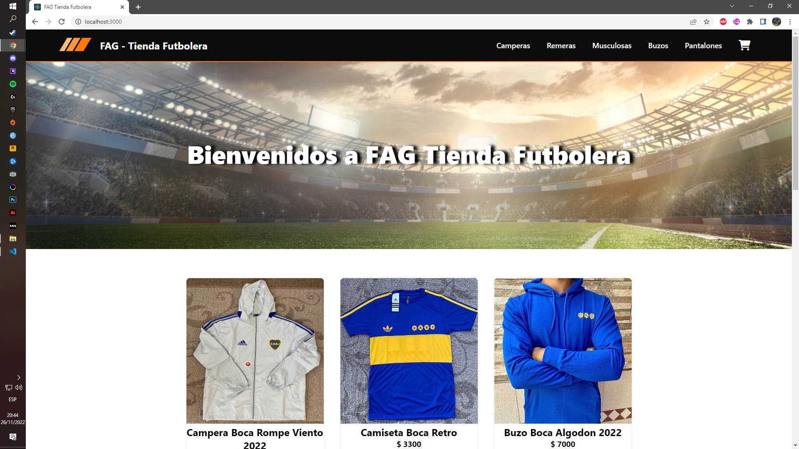

 FAG Tienda Futbolera - Indumentaria de tu Equipo
<br>

##  FAG Tienda Futbolera - Ecommerce
<br>



Este proyecto fue creado para el curso de **React Js** de CoderHouse.
Se trata de una tienda online o e-commerce sobre indumentaria de equipos de fútbol.


**Alumno:** Geretto Federico Adrián<br>
**Profesor:** Eric Wajnrajch

<br>

## Librerías utilizadas

| Librería | Utilización |
| --- | --- |
|[react-router-dom](https://reactrouter.com/en/main)| Se utilizó para crear las rutas de navegación de la página. |
|[Firebase](https://firebase.google.com/)| Lo utilicé para alojar los productos, así como también se guardan las ordenes de compra que cargan los usuarios.|
|[React-spinners](https://www.npmjs.com/package/react-spinners)| Fue empleado para introducir una animación en el loading de los productos obtenidos desde Firebase.|
<hr>
<br>

## Funcionalidades que tiene el proyecto

- Navegar entre los distintos productos y por categoría (Camperas, Remeras, Musculosas, Buzos y Pantalones)
- Ampliar el detalle de cada producto.
- Agregar la cantidad deseada de productos al carrito.
- Visualizar los productos en el carrito, así como el total de unidades y también el precio total.
- Hacer el Checkout para generar la orden de compra ficticia, que se enviará a Firebase con los datos ingresados.
<br>
<hr>
<br>

## Pasos para levantar el proyecto en local
<br>

1.  **Clonar el repositorio**

```
git clone https://github.com/fedegeretto/fag-tienda-futbolera.git
```

2. **Instalar las dependencias**

```
npm install
```

3. **Correr el proyecto en el navegador**

```
npm start
```